<div align="center">
  <h1>Duster</h1>
  <p><strong>Windows-native deep cleaner & system optimization CLI</strong></p>
  <p>A single-binary, zero-dependency terminal utility that cleans caches, analyzes disk usage, monitors system health, and purges developer artifacts, with a 7-day undo for what it removes.</p>
</div>

<p align="center">
  <a href="https://github.com/Nur-Adnan/Duster/releases/latest"></a>
  <a href="LICENSE"></a>
  <a href="https://github.com/Nur-Adnan/Duster/actions/workflows/ci.yml"></a>
  
  
</p>

<p align="center">
  
</p>

---

## Quick Start

```powershell
# Install (PowerShell one-liner)
irm https://raw.githubusercontent.com/Nur-Adnan/Duster/main/scripts/install.ps1 | iex

# Run
du             # Menu with system overview
du status      # Live system dashboard
du clean       # Deep cache cleanup
du analyze .   # Interactive disk explorer
```

---

<p align="center">
  
</p>

## Commands

| Command | What it does |
|:---|:---|
| `du` | Interactive menu: overview, drivers, startup apps, network, security |
| `du clean` | Scans and cleans 34 cache categories ([list](#cleanup-categories)) |
| `du status` | Live CPU (usage, temperature), RAM, disk, network and battery dashboard |
| `du analyze [path]` | Disk usage explorer; shows what grew since the last scan of the same folder |
| `du purge` | Removes `node_modules`, `target`, `dist`, `.gradle`, `vendor` and other build output |
| `du restore` | Lists and brings back what `purge`, `uninstall` and `installer` removed (7 days) |
| `du uninstall` | Runs an app's uninstaller, then sweeps its leftovers |
| `du installer` | Finds old `.exe` / `.msi` installers in Downloads |
| `du vdisk` | Shrinks WSL and Docker virtual disks (`.vhdx`) that grow but never shrink *(admin)* |
| `du schedule` | Cleans safe caches automatically (weekly by default, or when the drive runs low), never as admin |
| `du optimize` | Flushes DNS, clears Delivery Optimization, optimizes drives *(admin)*; `--deep` cleans WinSxS via DISM |
| `du doctor` | Environment, privilege and terminal diagnostics |
| `du benchmark` | Scan, delete, memory and JSON engine benchmarks |
| `du verify` | Self-tests: protected paths, link guards, dry runs, registry safety |
| `du update` | Self-update with SHA-256 verification and rollback |
| `du remove` | Uninstalls Duster and deletes its data |

`--json` works on most commands for scripting. Every command that deletes has `--dry-run`, and none deletes without asking unless you pass `--yes`. Details per release: [CHANGELOG.md](CHANGELOG.md).

**Undo.** `purge`, the uninstall leftover sweep and `installer` move what they remove into a quarantine on the same drive (no copy) for 7 days, or less if the drive drops below 10% free. `du restore <n>` brings a session back and never overwrites. `purge --permanent` deletes for good right away.

**Scheduled cleaning** runs through `duw.exe`, a windowless launcher next to `du.exe`, so no console window appears. It cleans only caches that rebuild themselves (temp, browser caches but never cookies or history, thumbnails, error reports, crash dumps, shader caches); `--add npm,gradle,...` opts developer and app caches in.

**What Duster reports but never deletes:** `Windows.old` and the hibernation file (`du optimize` shows their size and how to remove them), and the WSL sparse-disk setting (`du vdisk`).

---

## Cleanup Categories

| Group | Categories |
|:---|:---|
|  **System Core** | Temp, Windows Update cache, Prefetch *(admin)*, Error reports, Recycle Bin, DNS cache, Delivery Optimization, Memory dumps, Log files, Recent files, Font cache |
|  **Web Browsers** | Chrome, Edge, Firefox, Brave (all profiles), Opera |
|  **Developer Tools** | npm, pnpm, Yarn, Bun, pip, Cargo, Gradle, NuGet, Docker, VS Code, JetBrains |
|  **Applications** | Discord, Spotify, Slack, Teams, Steam, Epic, Adobe |
|  **GPU & Graphics** | Shader caches (DirectX, NVIDIA), Explorer thumbnails |
|  **Crash Data** | Crash dumps |

`du clean --dry-run` shows what each would free. `--whitelist npm,browsers` skips categories.

---

## Installation

The PowerShell one-liner in [Quick Start](#quick-start) is the recommended way.

<details>
<summary>Installer options</summary>

```powershell
.\install.ps1 -Version "1.3.0"        # Specific version
.\install.ps1 -InstallDir "C:\Tools"   # Custom directory
.\install.ps1 -Silent                  # No output (CI/automation)
.\install.ps1 -Force                   # Reinstall same version
```

</details>

**From CMD:**

```cmd
powershell -NoProfile -ExecutionPolicy Bypass -Command "irm https://raw.githubusercontent.com/Nur-Adnan/Duster/main/scripts/install.ps1 | iex"
```

**Setup exe or portable zip:** download `Duster-Setup-<version>-x64.exe` or `Duster-<version>-Portable-<arch>.zip` from [Releases](https://github.com/Nur-Adnan/Duster/releases/latest). Keep `du.exe` and `duw.exe` in the same folder, on your PATH.

**Scoop / winget:** not published yet; manifests are staged in [scripts/manifests/](scripts/manifests/).

**Uninstall:** `du remove`, or

```powershell
irm https://raw.githubusercontent.com/Nur-Adnan/Duster/main/scripts/uninstall.ps1 | iex
```

---

## Keys in `du analyze`

| Key | Action |
|:---|:---|
| `↑↓` / `jk` | Navigate |
| `Enter` / `→` / `l` | Open folder |
| `⌫` / `←` / `h` | Back |
| `c` | What changed since the last scan (Enter jumps to the item) |
| `o` | Open in Explorer |
| `d` | Send to Recycle Bin (asks first) |
| `L` | Largest files view |
| `q` | Quit |

---

## Safety

| Protection | How |
|:---|:---|
| **Protected paths** | System folders and `Windows.old` are never deleted; system dirs resolve via Win32, not env vars |
| **Links** | Never follows symlinks, junctions or reparse points |
| **OneDrive** | Skips cloud-only files, so a scan never downloads them |
| **Undo** | User-facing deletes go to the quarantine or Recycle Bin first (`du restore`) |
| **Admin only when needed** | Asks for elevation only for tasks that need it (Windows caches, defrag, vdisk, DISM); scheduled cleans never elevate |
| **Audit log** | Every delete is logged to `%LOCALAPPDATA%\Duster\operations.log` (`DU_NO_OPLOG=1` disables) |

Report a vulnerability: [SECURITY.md](SECURITY.md).

---

## Code signing policy

Free code signing provided by [SignPath.io](https://about.signpath.io/), certificate by [SignPath Foundation](https://signpath.org/). Signing starts once the project's SignPath Foundation application is approved; releases before that are unsigned. Who approves releases, what gets signed, and the privacy statement: [docs/code-signing.md](docs/code-signing.md).

---

## Build from Source

```powershell
git clone https://github.com/Nur-Adnan/Duster.git
cd Duster
go build -trimpath -ldflags="-s -w" -o du.exe .
go build -trimpath -ldflags="-s -w -H=windowsgui" -o duw.exe ./launcher/duw
go test ./...
```

Release builds: `make build`.

---

## Project Structure

```
Duster/
├── main.go           # Entry point (cobra root `du`)
├── cmd/              # One file per command, Bubble Tea TUIs
├── launcher/duw/     # duw.exe, windowless launcher for scheduled cleans
├── lib/
│   ├── elevation/    # UAC elevation
│   ├── fs/           # Path safety checks
│   ├── sysinfo/      # System stats, CPU temperature
│   └── uninstall/    # Installed apps from the registry
├── internal/logging/ # Operation log
├── e2e/              # Windows end-to-end tests (real du.exe in a console)
├── installer/        # Inno Setup script
├── scripts/          # install / uninstall scripts, package manifests
└── landing/          # Project website (Next.js)
```

---

## License

MIT License. Copyright © 2026 [Nur Adnan](https://github.com/Nur-Adnan)
