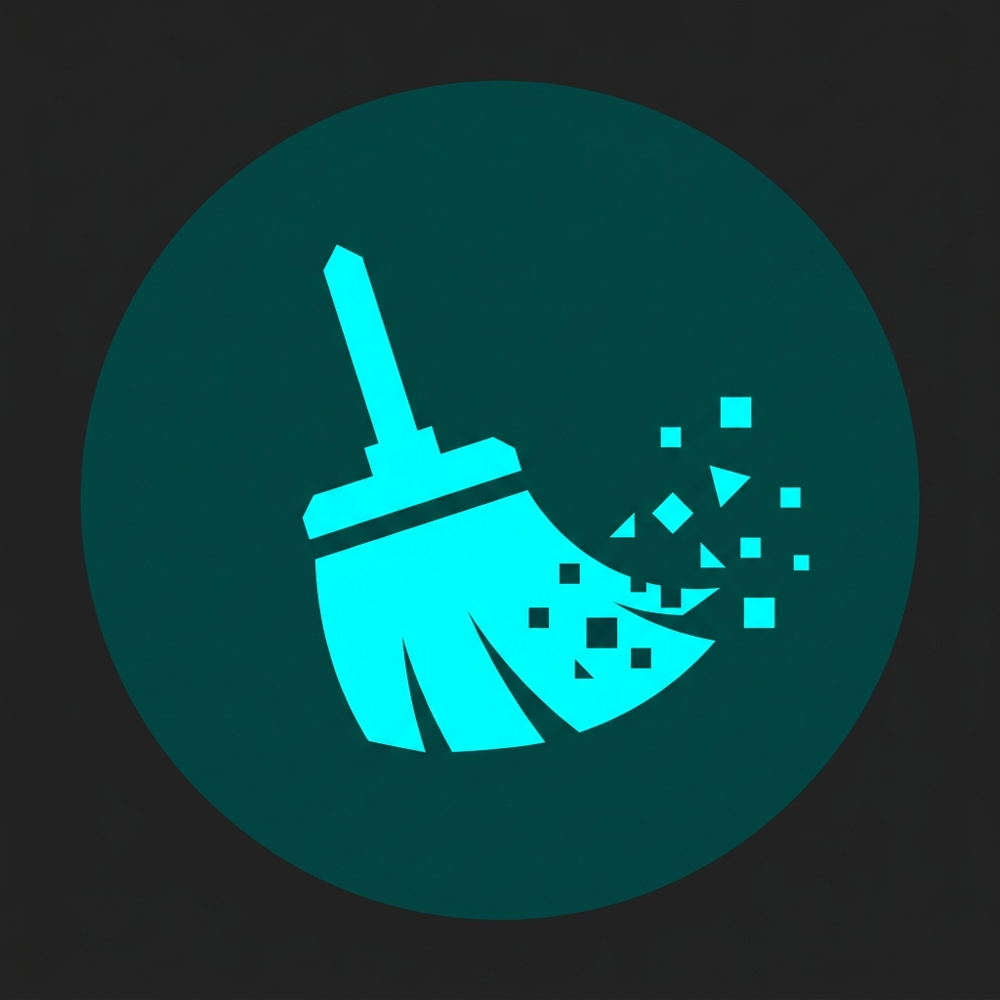
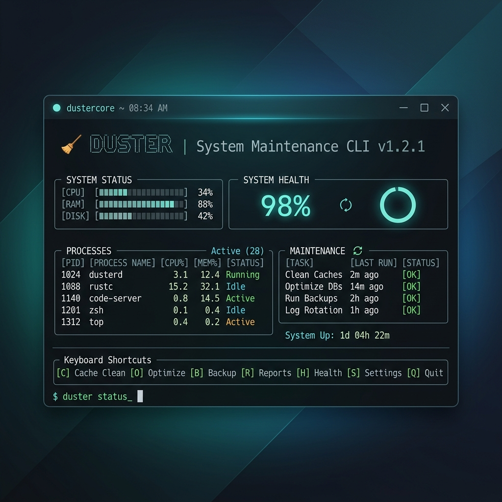

<div align="center">
  
  <h1>Duster</h1>
  <p><strong>Windows-native deep cleaner & system optimization CLI</strong></p>
  <p>A single-binary, zero-dependency terminal utility that cleans caches, analyzes disk usage, monitors system health, and purges developer artifacts — all from your terminal.</p>
</div>

<p align="center">
  <a href="https://github.com/Nur-Adnan/Duster/releases/latest"></a>
  <a href="LICENSE"></a>
  <a href="https://github.com/Nur-Adnan/Duster/actions/workflows/ci.yml"></a>
  
  
</p>

<p align="center">
  
</p>

---

## Quick Start

```powershell
# Install (PowerShell one-liner)
irm https://raw.githubusercontent.com/Nur-Adnan/Duster/main/scripts/install.ps1 | iex

# Run
du status      # Live system dashboard
du clean       # Deep cache cleanup
du analyze .   # Interactive disk explorer
```

---

## Features

| Command | What it does |
|:---|:---|
| `du` | Interactive landing screen with system overview |
| `du clean` | Scans & cleans 35 cache categories (temp, browsers, dev tools, GPU shaders) |
| `du status` | Real-time CPU, RAM, disk, network, battery dashboard (1s refresh) |
| `du analyze [path]` | Drill-down disk usage explorer with delete & open actions |
| `du purge` | Finds `node_modules`, `target`, `dist`, `.gradle`, `vendor` and purges them |
| `du uninstall` | App uninstaller + leftover AppData sweeper |
| `du installer` | Detects bulky old `.exe`/`.msi` installers in Downloads |
| `du optimize` | Network reset, defrag hooks, service optimizations |
| `du doctor` | System diagnostics (UAC, Defender, filesystem policies) |
| `du benchmark` | Disk I/O throughput & memory profiling |
| `du update` | Self-update with SHA-256 verification |
| `du remove` | Uninstall Duster and delete all its config/logs |

> Every command supports `--json` for scripting and `--dry-run` for safe previews.

---

## Cleanup Categories

Duster targets **35 cleanup zones** across 4 domains:

<details>
<summary><strong>💻 System & Windows</strong> (9 categories)</summary>

| Category | Target |
|:---|:---|
| Temp Files | `%TEMP%`, `C:\Windows\Temp` |
| Update Cache | `SoftwareDistribution\Download` |
| Prefetch | Windows prefetch binaries *(admin)* |
| Thumbnails | Explorer `thumbcache_*.db` files |
| Error Reports | Windows Error Reporting dumps |
| Recycle Bin | Native Recycle Bin cleanup |
| DNS Cache | Flush local DNS resolver |
| Delivery Optimization | Peer-to-peer update cache |
| Crash Dumps | Minidumps and crash logs |

</details>

<details>
<summary><strong>🚀 Developer Tools</strong> (10 categories)</summary>

| Category | Target |
|:---|:---|
| npm | Global npm cache |
| pnpm | Content-addressable store |
| Yarn | Downloaded package tarballs |
| Bun | JS runtime cache |
| pip | Python package metadata |
| Cargo | Rust crate indexes |
| Gradle | Java/Kotlin build cache |
| NuGet | .NET assembly cache |
| Docker | Desktop build artifacts |
| VS Code | Extension logs & language server cache |

</details>

<details>
<summary><strong>🌐 Browsers</strong> (1 multi-profile scanner)</summary>

Clears cache from **Chrome**, **Edge**, **Firefox**, and **Brave** across all user profiles.

</details>

<details>
<summary><strong>🎮 GPU & Shaders</strong> (1 category)</summary>

Purges DirectX, OpenGL, and NVIDIA compiled shader caches to fix micro-stuttering.

</details>

---

## Installation

### PowerShell (Recommended)

```powershell
irm https://raw.githubusercontent.com/Nur-Adnan/Duster/main/scripts/install.ps1 | iex
```

<details>
<summary>Advanced options</summary>

```powershell
.\install.ps1 -Version "1.0.2"        # Specific version
.\install.ps1 -InstallDir "C:\Tools"   # Custom directory
.\install.ps1 -Silent                  # No output (CI/automation)
.\install.ps1 -Force                   # Reinstall same version
```

</details>

### CMD

```cmd
powershell -NoProfile -ExecutionPolicy Bypass -Command "irm https://raw.githubusercontent.com/Nur-Adnan/Duster/main/scripts/install.ps1 | iex"
```

### Scoop

```powershell
scoop bucket add duster https://github.com/Nur-Adnan/scoop-duster
scoop install duster
```

### winget

```powershell
winget install NurAdnan.Duster
```

### Manual Download

Download from [Releases](https://github.com/Nur-Adnan/Duster/releases/latest), rename to `du.exe`, and add to PATH.

### Verify

```powershell
du --version
```

### Uninstall

```powershell
irm https://raw.githubusercontent.com/Nur-Adnan/Duster/main/scripts/uninstall.ps1 | iex
```

---

## Keyboard Shortcuts

| Key | Action |
|:---|:---|
| `↑↓` / `jk` | Navigate lists |
| `Enter` / `→` | Drill into folder |
| `Esc` / `←` | Go back |
| `O` | Open in Explorer |
| `D` / `⌫` | Delete to Recycle Bin |
| `L` | Toggle large files view |
| `Space` | Toggle selection |
| `Q` | Quit |

---

## Security

| Protection | How |
|:---|:---|
| **UAC Elevation** | Prompts for admin only when needed (prefetch, defrag) |
| **Path Safety** | System folders resolved via Win32 API, not env vars |
| **Junction Protection** | Detects NTFS reparse points to prevent infinite recursion |
| **OneDrive Shield** | Skips `FILE_ATTRIBUTE_OFFLINE` files to prevent cloud sync |
| **Process Isolation** | Subprocesses run in separate process groups for clean exit |
| **Audit Log** | All deletions logged to `%LOCALAPPDATA%\Duster\operations.log` |

> Disable logging: `set DU_NO_OPLOG=1`

---

## Build from Source

```powershell
git clone https://github.com/Nur-Adnan/Duster.git
cd Duster
go build -trimpath -ldflags="-s -w" -o du.exe .
go test ./...
```

---

## Project Structure

```
Duster/
├── cmd/              # CLI commands, Bubble Tea TUIs, Lipgloss styles
├── lib/
│   ├── elevation/    # UAC privilege escalation
│   ├── fs/           # Safe path resolution & NTFS checks
│   ├── sysinfo/      # Win32 system queries (gopsutil)
│   └── uninstall/    # Registry-based app discovery
├── internal/
│   ├── config/       # Configuration management
│   ├── logging/      # Structured operation logging
│   └── security/     # Security policy enforcement
├── scripts/          # Install/uninstall scripts (PS1, CMD, batch)
├── installer/        # Inno Setup configuration
└── main.go           # Entry point
```

---

## License

MIT License — Copyright © 2026 [Nur Adnan](https://github.com/Nur-Adnan)
